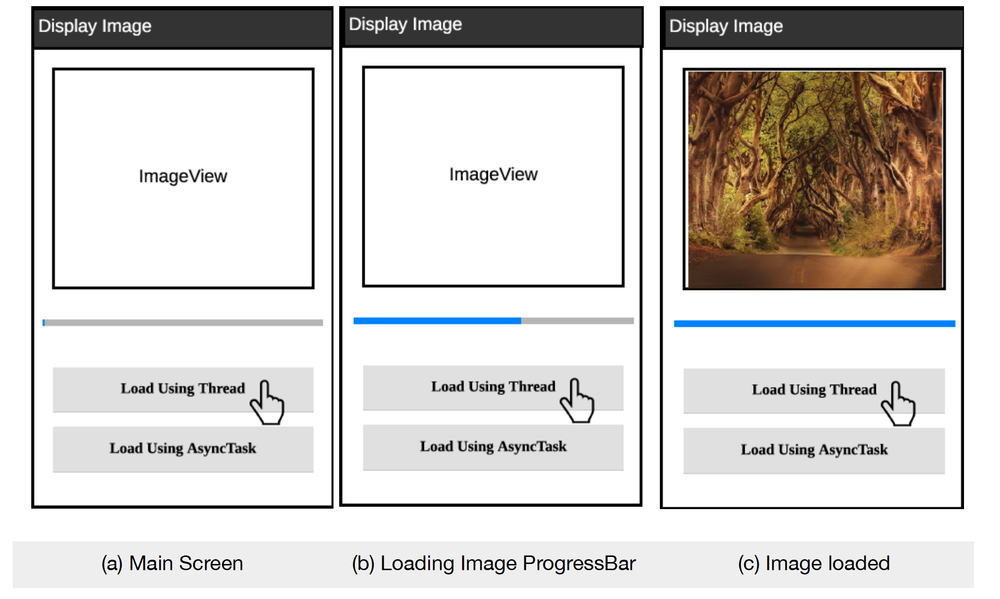

# ImageDisplayApplication

This application consists of a single activity. The elements are:
1. An ImageView to display the images.
2. A ProgressBar to display the progress of loading image.
3. Two buttons to select from Thread and AsyncTask to load the images.

## Using Threads: 
1. In the first part I used threads to download and display the images.
2. Clicking on “Load Using Thread” button creates a thread to load the Bitmap of
image using the URL provided.
3. The URL for the image for downloading using Thread is: https://
cdn.pixabay.com/photo/2017/12/31/06/16/boats-3051610_960_720.jpg
4. Displayed the progress of loading the image using a Horizontal Progress
Bar.
5. Set the progress to ZERO after loading the image successfully into the
ImageView.

## Using AsyncTasks: 
1. Next part is to load another image using AsyncTask.
2. The URL for the image to be downloaded using AsyncTask is: https://
cdn.pixabay.com/photo/2014/12/16/22/25/youth-570881_960_720.jpg
3. Clicking on the “Load Using AsyncTask” button should use an AsyncTask to load the
image to the ImageView.
4. The ProgressBar is implemented as I did in the first part.

